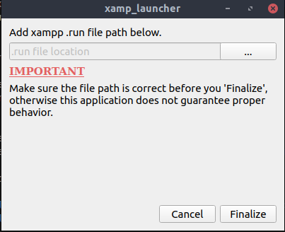
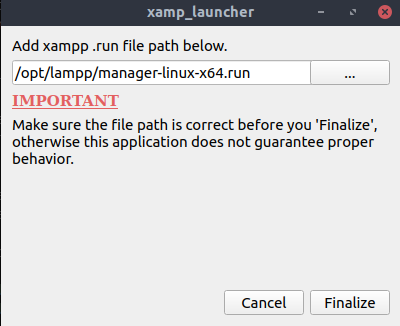
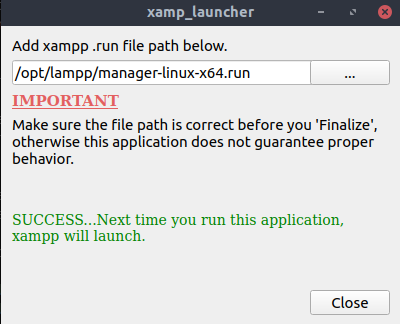

Running Application without installation

Executable is located in directory: target/xamp_linux_launcher/xamp_linux_launcher

<h1>Installing</h1>

1. cd to target/
2. run 'sudo dpkg -i xamp_linux_launcher.deb'
3. installation is run on 'sudo' so you will need to enter your password

<h2>Install location</h2>
<ul>
    <li>By default, application is installed in the opt/ directory.</li>
    <li>If you have issues removing the application through dpkg, then you can uninstall from within opt/ with rm -rf or something else.</li>
</ul>

<h1>Uninstall</h1>

1. Open Terminal
2. run command: 'sudo dpkg --purge xamp_linux_launcher'

<h1>Setup</h1>

When you first install this application, you will need to run a one time setup to configure the executable.  This includes: 

<ul>
    <li>Agree to license conditions (GNU AGPL v3)</li>
    <li>Configure xampp executable</li>
</ul>

<h2>Configuring xampp executable</h2>

After agreeing to the terms and conditions, you will have to configure executable.  This program creates an executable icon by linking it to the xampp .run file in the application directory.

<ul>
<li></li>
</ul>

